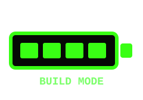
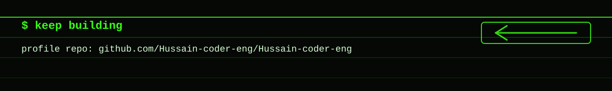

<table align="center" border="0" cellspacing="0" cellpadding="0">
  <tr>
    <td valign="middle">
      <table border="0" cellspacing="0" cellpadding="2" bgcolor="#39FF14">
        <tr>
          <td>
            <table border="0" cellspacing="0" cellpadding="16" bgcolor="#050805">
              <tr>
                <td width="760">
                  <code>$ whoami</code> 
                  <code>Hussain Altufayli</code> 
                  <code>$ current-role</code> 
                  <code>AI Engineering Intern at Avis Budget Group</code> 
                  <code>$ focus</code> 
                  
                </td>
              </tr>
            </table>
          </td>
        </tr>
      </table>
    </td>
    <td width="16"></td>
    <td valign="middle">
      
    </td>
  </tr>
</table>

## About Me

I am Hussain Altufayli, an AI Engineering student at Penn State University with a 3.67 GPA and an expected graduation date of May 2029. I build AI/ML systems with product judgment: clear API contracts, model-backed workflows, useful interfaces, and metrics that help teams decide what to ship next.

I am an AI Engineering Intern at Avis Budget Group for Summer 2026. Previously, I was an AI Engineering Intern at WanderBug AI, where I shipped production-level iOS features that activated agentic workflows, defined REST API contracts between client and server, and owned RAG design plus prompt engineering for LLMs that transformed user queries into personalized geospatial routes.

## Role Fit

- Translate ambiguous user problems into model-backed product workflows, from LLM/RAG route generation to NLP inference dashboards and telemetry classifiers.
- Define REST API contracts and client-server boundaries so AI features can move from prototype to production without losing product clarity.
- Build metrics, dashboards, and explainability views with Pandas, Plotly, SHAP, Recharts, and model validation workflows.
- Prototype quickly while keeping delivery habits grounded in Git, code reviews, debugging/profiling, and production deployment.
- Connect user impact to implementation details, including scheduling and notification systems at WanderBug that supported 400+ users.

## Experience Signals

- WanderBug AI: collaborated in a founding team of three engineers, built Swift iOS features, designed RAG and prompts for personalized geospatial routes, and used rapid prototyping, version control, and code reviews to ship production workflows.
- Reflexion VR: produced data-driven insights for the NFL, NASCAR, and the Women's National Boxing Team; tested AI-driven VR/AR features using behavior and performance metrics; documented rendering/performance defects; proposed ML-based adaptive training features.
- IU13: built 10+ production pages with HTML5, Bootstrap, and C#; translated business requirements into deployed solutions; configured 100+ devices for reliable field use.

## Selected Projects

- Drawn: AI-powered GPS art route product for shape, text, and draw-based route generation. Built with React 19, TypeScript, Tailwind CSS 4, Google Gemini 2.5 Flash, React-Leaflet, OpenStreetMap, Overpass API, OSRM, OpenRouteService fallback, Turf.js, Firebase Auth/Firestore, and Motion/Framer Motion. Product features include AI anchor selection, route scoring/retry, live GPS run navigation, GPX export, and Apple/Google Maps handoff.
- LatentLap-AI: telemetry ML system for predicting hidden tire degradation states from 2021-2025 Silverstone/McLaren FastF1 data. Built with Python, Pandas, NumPy, SciPy/Savitzky-Golay smoothing, XGBoost, scikit-learn metrics, SHAP/native XGBoost contribution explainability, Plotly reports, Next.js 14, React 18, TypeScript, Recharts, Three.js/react-three-fiber, and Tailwind.
- Amazon Reviews Sentiment Analysis: NLP project analyzing 5,000+ Amazon food reviews with preprocessing, tokenization, model training, dashboarding, and inference visualization. Used NLTK, Transformers, TensorFlow, PyTorch, RoBERTa, VADER, Plotly, Pandas, and NumPy.

## AI / ML

  
  
  
  
  
  
  
  
  
  
  
  

## Data / Analytics

  
  
  
  
  
  
  

## Product Engineering

  
  
  
  
  
  
  
  

## Product / Delivery

  
  
  
  
  
  

## Connect

  
  
  

  

