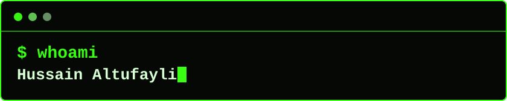

  
  

  

  

## About Me

I am Hussain Altufayli, an AI Engineering student at Penn State University focused on practical software, machine learning, and hands-on technical projects.

I love exploring new technologies and models as they come out, then turning that curiosity into working projects: ML experiments, AI-assisted tools, software prototypes, and hardware builds with Arduino and Raspberry Pi.

## Current Focus

- Studying AI Engineering at Penn State University.
- Building software projects that connect clean interfaces with useful AI and ML workflows.
- Experimenting with models, data tools, and visualization libraries as the ecosystem evolves.
- Exploring hardware projects with Arduino and Raspberry Pi when code needs to meet the physical world.

## Tech / Tools

  
  
  
  
  
  
  
  
  
  
  
  
  
  
  
  
  
  
  

## Connect

  
  
  
  

  

